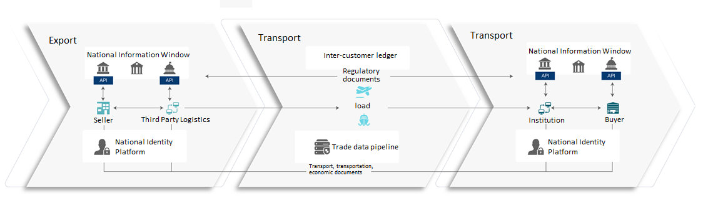

# Sharing Solution
  
Build a cross-border cooperation platform based on the blockchain, realize the main chain to support online orders, insurance, ocean shipping and other low-density businesses through a unified window and multi side chain scheme, and the side chain to support high-density interaction such as product manufacturing, retail distribution, and efficient data transmission and safe sharing.
